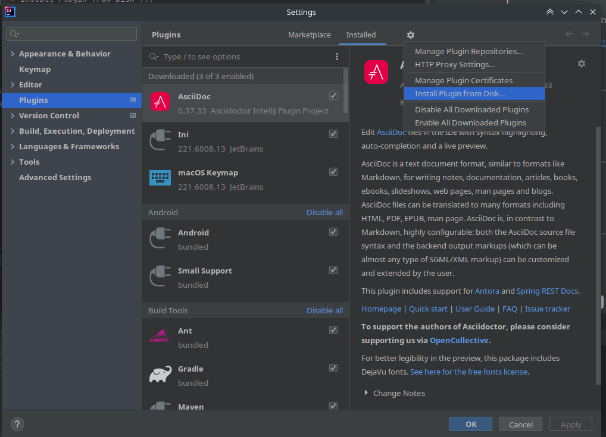
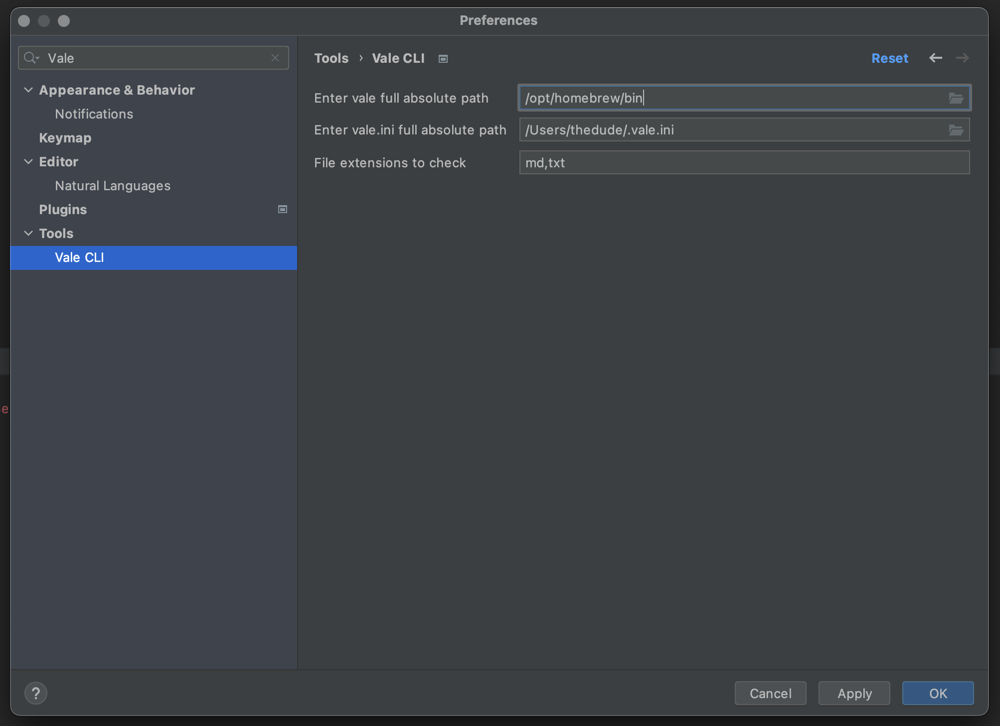
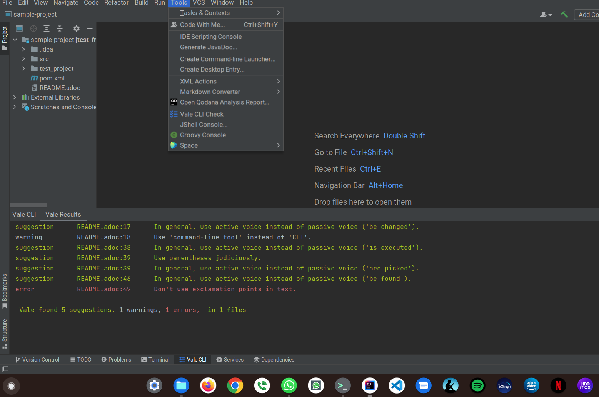
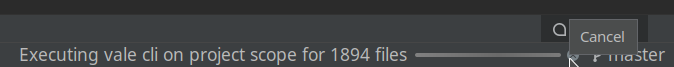
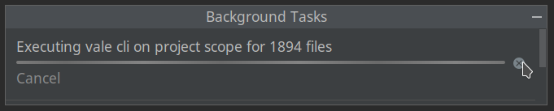
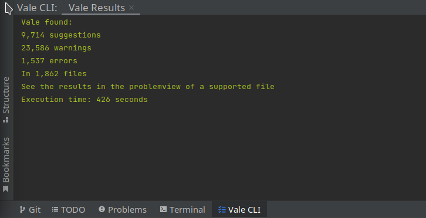
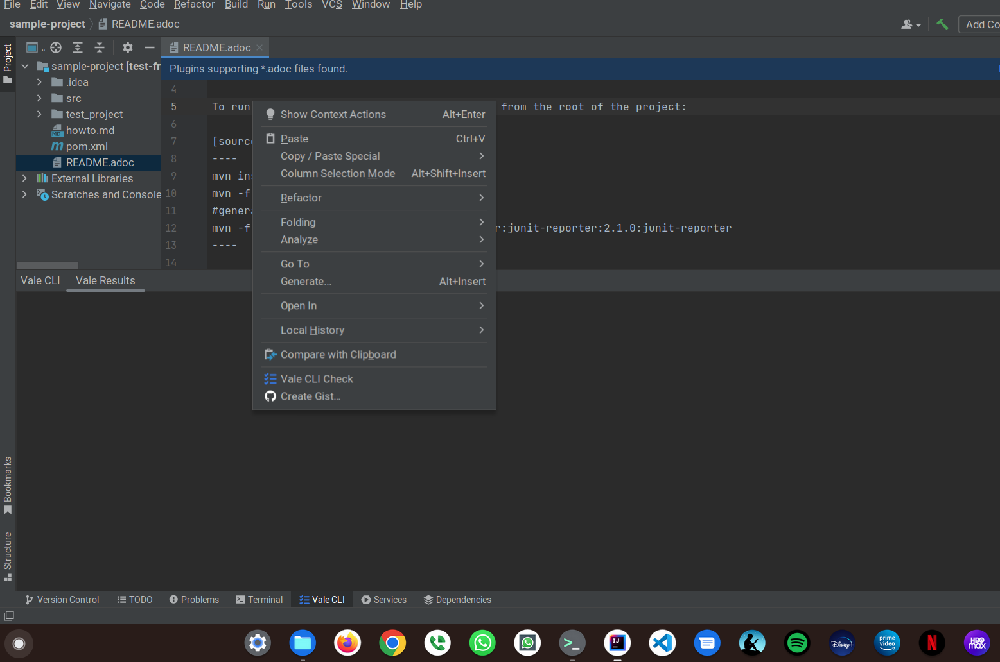
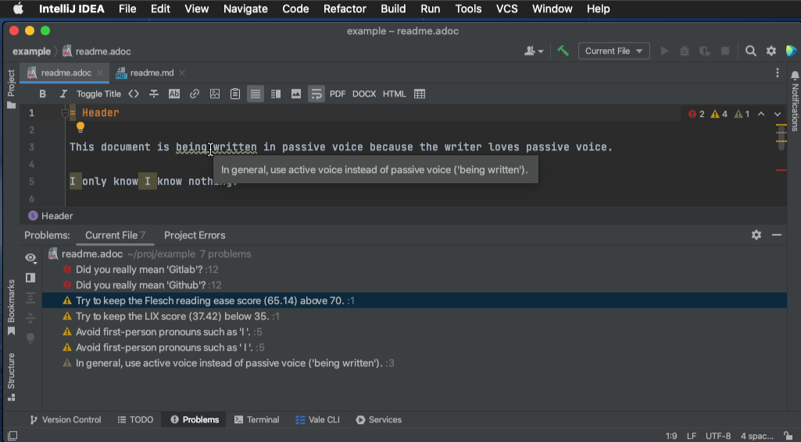
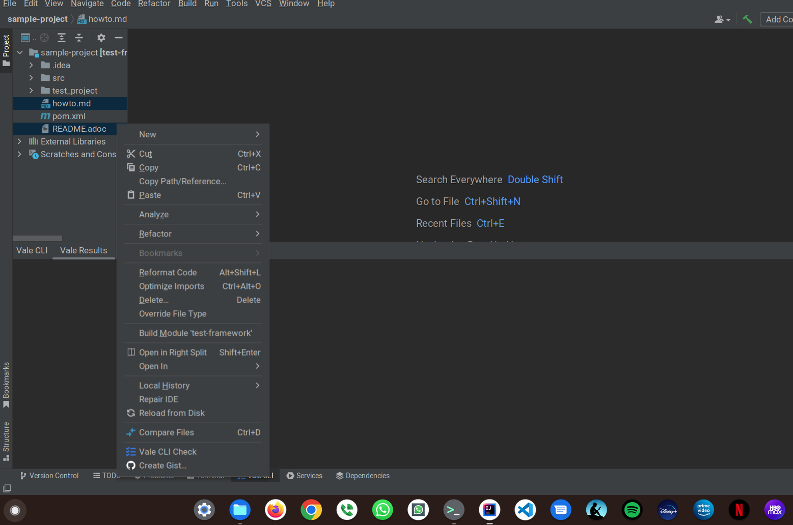

= Vale CLI plugin
:icons: font

image:https://gitlab.com/pablomxnl/vale-cli-plugin/-/badges/release.svg[link="https://gitlab.com/pablomxnl/vale-cli-plugin/-/releases",title="Latest Release"]
image:https://img.shields.io/jetbrains/plugin/d/org.ideplugins.vale-cli-plugin[link="https://plugins.jetbrains.com/plugin/19613-vale-cli",title="Downloads"]
image:https://img.shields.io/gitlab/issues/open/pablomxnl/vale-cli-plugin?style=plastic[link="https://gitlab.com/pablomxnl/vale-cli-plugin/-/issues", title="GitLab issues"]
image:https://img.shields.io/jetbrains/plugin/r/stars/org.ideplugins.vale-cli-plugin[link="https://plugins.jetbrains.com/plugin/19613-vale-cli/reviews",title="Ratings"]
image:https://img.shields.io/jetbrains/plugin/v/org.ideplugins.vale-cli-plugin[link="https://plugins.jetbrains.com/plugin/19613-vale-cli",title="Version"]
image:https://gitlab.com/pablomxnl/vale-cli-plugin/badges/main/coverage.svg[link="https://gitlab.com/pablomxnl/vale-cli-plugin/-/commits/main",title="Coverage report"]

Plugin for JetBrains IDE's that uses https://vale.sh[Vale CLI] to check markdown,asciidoc and other documentation formats

TIP: Pet project. Not associated with Errata (Vale CLI creators) or JetBrains whatsoever

== Installation

=== From plugin marketplace

`Settings` -> `Plugins` -> `Marketplace` Search for `Vale CLI` -> Click `Install`

=== From Gitlab releases
To install, grab a zip file from the
https://gitlab.com/pablomxnl/vale-cli-plugin/-/releases[releases distributions] according to your IDE

`Settings` -> `Plugins` -> `⚙` -> `Install Plugin from Disk...`

=== Pre-Requistes

NOTE: Requires Vale CLI installed.
Please review the https://vale.sh/docs/vale-cli/installation/[Vale CLI installation guide]

* https://vale.sh[Vale CLI] installed and with minimal https://vale.sh/generator/[styles configured].
* Install the dependencies of the https://vale.sh/docs/topics/scoping/#formats[vale formats] configured. +
For example, to check `asciidoctor` and `reStructuredTex` documents, Vale CLI requires `asciidoctor gem` and python package `rst2html` accordingly in the system path. +
To verify the setup, run `vale adoc_file_or_rst_file` in the integrated terminal. +
In some operating systems using a version manager like `rvm` or `pyenv` can help to solve these path issues. In others cases, helps to install these dependencies with the OS package manager.

== Configuration

The plugin has 3 configurations:

   . vale binary location: required when the plugin couldn't find it automatically in the system path
   . vale settings file location: required when want to use a configuration file located in a path different from where the binary looks for it.
   . file extensions to check:  pre-set to `md,adoc`, it requires at least one extension.

To enter this configuration go to
`Settings` -> `Tools` -> `Vale CLI`

== Usage
The plugin offers three ways to execute Vale CLI

=== Tools menu, project scope

To run Vale against project files use the menu in `Tools` => `Vale CLI Check`

For projects with large amount of documentation files, depending on machine the execution can take a while, the user can stop the process at any time by clicking on the `✖️` button.

As the cancel button can be hard to click, another way to cancel the execution is to click in the "Executing vale cli on project scope" text to show the Background Tasks dialog and from the dialog the `✖️` button is easier to click. To hide the dialog, just click the minimize button or click the "Hide processes" link

Once the process has concluded it prints a summary of the results on the tool window, to see these results, open a supported file and look them on the problem view or in the editor.

=== Editor contextual menu
To check the current opened file in the editor, providing the file extension matches one of the extensions configured in the plugin settings.

Once the process has finished, it activates the problem view with the results, and also the editor has markers annotated to these

=== Multiple files selected on the Project tree

By selecting several files whose extension matches the configured extensions and selecting the contextual menu option

Once the process has finished, it activates the problem view with the results, and also the editor has markers annotated to these

== Uninstall

. Go to `Settings` => `Plugins` => `Installed`
. Click `Vale CLI` entry and click the gear `⚙` icon. Older IntelliJ versions had a `Disabled` dropdown
. Select `Uninstall`

image::docimages/uninstall.png["Uninstall"]
